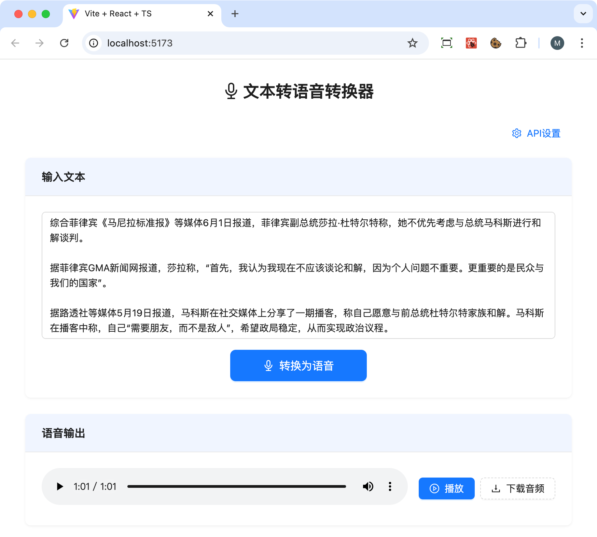

# MeloTTS UI 界面

MeloTTS 的前端 UI，用于测试基于服务器提供服务的 MeloTTS 模型。

见：



MeloTTS 的缺点是音调忽高忽低。

MeloTTS 服务器端，可以使用： [marshalw/melo-tts-server](https://hub.docker.com/r/marshalw/melo-tts-server)

可以这样使用，`docker-compose.yaml`:

```yaml
services:
  melotts-web:
    image: marshalw/melo-tts-ui
    container_name: melotts-ui
    ports:
      - "7776:80"

  melotts-server:
    image: marshalw/melo-tts-server:latest
    container_name: melotts-server
    ports:
      - "7777:8080"
    environment:
      - DEFAULT_SPEED=1
      - DEFAULT_LANGUAGE=ZH
      - DEFAULT_SPEAKER_ID=ZH
    deploy:
      resources:
        reservations:
          devices:
            - driver: nvidia
              count: all
              capabilities: [gpu]

```